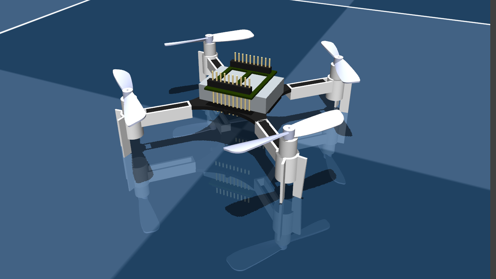

# Crazyflie2 MuJoCo XML

This repository contains a rough conversion of the Crazyflie2 model from the [Bitcraze](https://www.bitcraze.io/) to a MuJoCo XML file, in the approximate format required by `mujoco_menagerie`
 The reference model used is from the repository [crazyflie_ros](https://github.com/whoenig/crazyflie_ros)).
The conversion was done using [Blender](https://www.blender.org/).

The actuation implemented is Combined Thrust and Body Moments about the CoM. The inertial properties are set to values obtained from the datasheet and [MIT's system identification](https://groups.csail.mit.edu/robotics-center/public_papers/Landry15.pdf)
